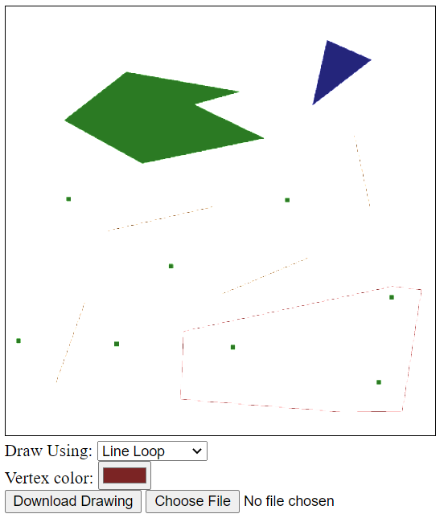

# WebGL Vector Drawing Program

This program allows users to select one of the WebGL drawing modes (points, lines, line strip, line loop, triangles, triangle strip, and triangle fan) and vertex color, which are used to draw shapes on the canvas.

To draw, click on the drawing canvas to add vertices, which will draw points, lines, or triangles (whichever mode was selected).

The drawing can also be downloaded as a JSON file and be reuploaded to continue drawing at a later time.

 
